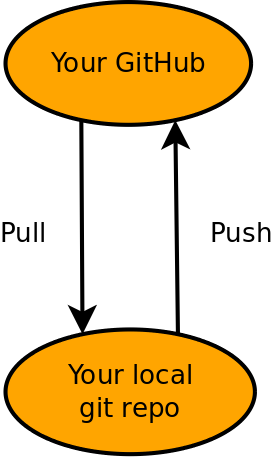
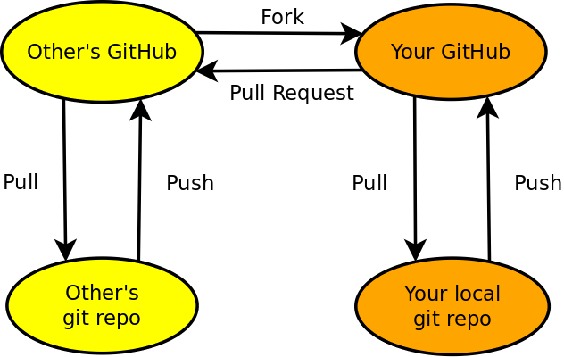

# Welcome back! #

## Purpose: ##

To review Git in more detail, give you more practice exercises that
mimic what you may do in your day-to-day research activities, and show
you how GitHub can be used for collaboration.

# Notes and help during this workshop #

Go to this website:

<https://etherpad.mozilla.org/camWorkshops>

# Version control refresher #

. . .

# What is version control[^gitvcs] (VC) #

* Keeps a history of everything done in a folder
* Can revert to previous change, try new things out
* Don't have to worry about losing what you wrote!

. . .

## Importance of VC! ##

* Future of journals and retractions
* Transparency, scientific rigor
* Protect against accusations of fraud

[^gitvcs]: See the Git website
    ([click here](http://git-scm.com/book/en/v2/Getting-Started-About-Version-Control))
    for more detail.

# Visualization of VC[^gitpic] #

[^gitpic]: Taken from the Git site
    ([click here](http://git-scm.com/book/en/v2/Getting-Started-Git-Basics))

# Using Git #

Before we start...The command line is **not** something to be afraid
of!!  Open up the terminal (Mac/Linux) or Git Bash (Windows).

# GitHub #

GitHub[^gitserver] is a place to store your git repo for several
reasons:

1. As a backup
2. To use across computers
3. To share with others

. . .

Check out the [cheatsheet](../cheatsheet).

[^gitserver]: Or <http://BitBucket.org>

# Create a GitHub account #

# How GitHub works #

# How GitHub Forking (collaboration) works

# Live coding -- Create git repo from scratch and push to GitHub #

Tip: Most of the time you don't really need to remember the code, just
google search it!  Or use our [cheatsheet](../cheatsheet)!! :D

# Optional exercise -- Collaborate on a project #

. . .

1. Create a git repository in a new folder or your own research folder
2. Create a SAS (or R) file to practice in or add your own files
3. Run basic stats (means) or change a file in your own folder
4. Add and commit your changes to Git
5. Create a GitHub repo and push your changes to it*
6. Fork a friend's repo on GitHub (or someone fork yours) and clone
   onto your computer
7. Change a friend's files
8. Push the changes and make a pull request
9. Check out your own pull requests!
