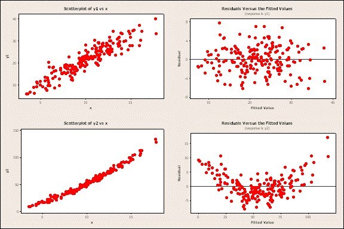
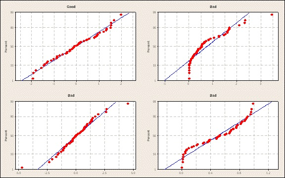
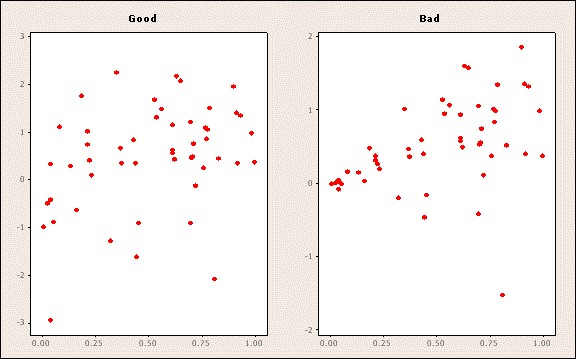

# Welcome to our Statistical Assumptions workshop #

## Purpose: ##

To teach the statistical assumptions of linear regression and show how you test data to see if they satisfy the assumptions. Knowing how to check these assumptions is part of "best practices" in data analysis. 


## Significance: ##

It is very important to check that your data satisfies linear regression assumptions. If your data does not meet these criteria, the use of linear regression is inappropriate. Other methods can be used, but...


# Caveat (again): We aren't here to teach statistics #

Need help with stats? Use these resources!

* U of T Statistical Consulting Services ([click here](http://www.utstat.toronto.edu/wordpress/?page_id=25))

* <http://www.stackoverflow.com>

* <http://stats.stackexchange.com>

* Helpful statistical tests flowchart (PDF on GitHub)

* Very helpful webpage on regression diagnostics: <http://www.ats.ucla.edu/stat/sas/webbooks/reg/chapter2/sasreg2.htm>
(Note: Goes into much more detail than what is covered in this workshop)


# Notes and help during this workshop #

Go to this website:

<https://etherpad.mozilla.org/dnsWorkshops>

# Linear Regression #

* Used to test associations between independent and dependent variables

* Based on a linear relationship: $y = X\beta + \varepsilon$
    - y = dependent variable(s)
    - $\beta$ = slope
    - X = independent variable
    - $\varepsilon$ = error, or residual, terms

# Some Linear Regression Assumptions #

* Model is good (i.e. linear relationship between predictors and outcome variable)

* Residuals[^1] have a normal distribution

* Residuals are homoscadastic (have equal/constant variance)

[^1]: Residual (aka the error term) = observed - expected

# Other Checks to Ensure Appropriate Model #

* Check for collinearity (predictors that are highly linearly related -- may result in inaccurate estimates of regression coefficients)

* Check for influence (i.e. outliers)

# Brief aside: assumptions/diagnostics we are not covering in this workshop #

* Independence (residuals of one observation are not associated with residuals of another)

* Errors in variables (predictor variables are measured without error)

* Very helpful webpage on regression diagnostics that covers these: <http://www.ats.ucla.edu/stat/sas/webbooks/reg/chapter2/sasreg2.htm>

# How to check assumptions #

* Model fit: Plot residuals vs. predicted fit (check pattern)

* Distribution of residuals: Normal probability plot

* Variance of residuals: Plot residuals vs. predicted fit (check spread of points)

# Model fit #

```

    * Run a scatter plot;
    proc sgplot data=sashelp.fish;
        scatter x=weight y=length1;
    run;

```

# Model fit #



# Residual distribution #

```
    * Run a linear regression model and output the ;
    * residual and predicted terms to a new dataset;
    proc reg data=sashelp.fish;
        model height=weight;
        output out=resid residual=r predicted=fit;
    run;
    quit;

    * Create a plot of the new output dataset;
    goptions reset=all;
    proc univariate data=resid normal;
        var r;
        qqplot r / normal(mu=est sigma=est);
    run;
```

# Residual distribution #



# Residual variance #

```

    proc reg data=sashelp.fish;
        model height=weight;
        plot r.*p.;
    run;
    quit;

```

# Residual variance #



# What do you do if your data does not meet these assumptions? #

> * Try transforming the data (log, square root)
    
        data new;
            set sashelp.fish;
            logWt = log(Weight);
            run;

> * Use a non-parametric statistical test if can not obtain normal distribution of residuals after attempting a transformation

# Collinearity #

* What is it? Two or more predictors in a model that are moderately to highly correlated with one another (e.g. BMI and body weight)

. . .

* Check VIF (variance inflation factor)
    - OR Check tol (tolerance = 1/vif)

```

    proc reg data=sashelp.fish;
        model height = weight length / vif tol;
    run;
    quit;

```

* VIF > 10 or tol < 0.1 suggest collinearity is present

# Influence #

> * Make a scatterplot of all observations

```

    proc gplot data=sashelp.fish;
        plot height*weight=1 / vaxis=axis1;
    run;
    quit;

```

> * Do a visual check for extreme observations

> * OR proc univariate will output extreme observations

> * Observation is "influential" if removing it substantially changes the estimate of coefficients (sometimes! exception: genetics--extreme observations may be hyper/hypo-responders)

# Main Exercise #

1. Download the Statistical Tests Flowchart from GitHub (.pdf).
2. Use the SAS help dataset fish (`sashelp.fish`) or your own data.
3. Perform assumptions check using your statistical analysis software.
4. Write a report summary of results for the assumptions we covered and conclude whether or not linear regression is appropriate for this data.
5. Check for collinearity and influence.

